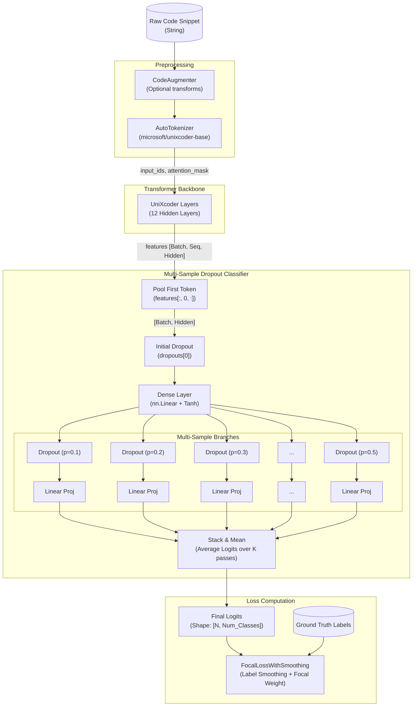

# Network Architecture and Information Flow

The following sequence details the flow of information through the modified `microsoft/unixcoder-base` model, including the newly implemented `MultiSampleDropoutClassifier` and structured loss functions (`FocalLossWithSmoothing`).

### Key Enhancements Visualized:
1. **Multi-Sample Dropout Classifier:** The diagram shows how the pooled hidden state branches into multiple dropout layers. The network performs classification on each branch in parallel and averages the resultant logits, improving generalization without adding parameters.
2. **Pooling:** Unlike standard sequence classification which sometimes uses a designated pooler, the current flow manually extracts the first token representation `features[:, 0, :]` before feeding it into the multi-sample dropout projection.
3. **Robust Loss Computation:** The averaged final logits pass into `FocalLossWithSmoothing`, allowing the model to simultaneously handle class imbalance (Focal Loss) and over-confidence constraints (Label Smoothing).